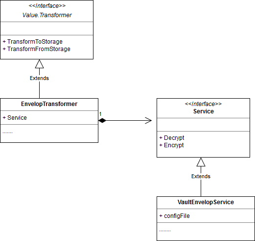

# Vault based KMS provider for envelope encryption of secrets in etcd3

## Abstract

Kubernetes, starting with the release 1.7, adds Alpha support ( via PRs [41939](https://github.com/kubernetes/kubernetes/pull/41939) and [46460](https://github.com/kubernetes/kubernetes/pull/46460)) to encrypt secrets and resources in etcd3 via a configured Provider. This release supports three providers viz. aesgcm, aescbc, secretbox. These providers store the encryption key(s) locally in a server configuration file. The provider encrypts and decrypts secrets in-process.
Building upon these, a KMS provider framework with an option to support different KMS providers like google cloud KMS is being added via PRs [48574](https://github.com/kubernetes/kubernetes/pull/48575) and [49350](https://github.com/kubernetes/kubernetes/pull/49350). The new KMS provider framework uses an envelope encryption scheme.

This proposal adopts the KMS provider framework and adds a new KMS provider that uses Hashicorp Vault with a transit backend, to encrypt and decrypt the DEK stored in encrypted form in etcd3 along with encrypted secrets.

Vault is widely used for Data encryption and securely storing secrets. Externalizing encryption/decryption of kubernetes secrets to vault provides various benefits

* Choice of industry standard encryption algorithms and strengths without having to implement specific providers for each (in K8S).
* Reduced risk of encryption key compromise.
    * encryption key is stored and managed in Vault.
    * encryption key does not need to leave the Vault.
    * Vault provides ability to define access control suitable for a wide range of deployment scenarios and security needs.
    * Vault provides In-built auditing of vault API calls.
* Ability for a customer already using Vault to leverage the instance to also secure keys used to encrypt secrets managed within a Kubernetes cluster
* Separation of Kubernetes cluster management responsibilities from encryption key management and administration allowing an organization to better leverage competencies and skills within the DevOps teams. 

Note, that the Vault Provider in this proposal

1. **requires** Vault transit backend. 
2. supports a wide range of authentication backends supported by vault (see below for exact list).
3. does not depend on specific storage backend or any other specific configuration.

This proposal assumes familiarity with Vault and the transit back-end.

## High level design
As with existing providers, the Vault based provider will implement the interface ``KMSService``. Based on value of *kind* in the KMS provider configuration, the ``KMSTransformer`` module will use an instance of the Vault provider for decryption and encryption of DEK before storing and after reading from the storage.

The KEK will be stored and managed in Vault backend. The Vault based provider configured in KMS Transformer configuration will make REST requests to encrypt and decrypt DEKs over a secure channel, if TLS is enabled. KMS Transformer will store the DEKs in etcd in encrypted form along with encrypted secrets. As with existing providers, encrypted DEKs will be stored with metadata used to identify the provider and KEK to be used for decryption.

The provider will support following authentication back-ends

* Vault token based,
* TLS cert based,
* Vault AppRole based.

Deployers can choose an authentication mechanism best suited to their requirements.
The provider will work with vault REST APIs and will not require Vault to be configured or deployed in any specific way other than requiring a Transit Backend.

### Diagram illustrating interfaces and implementations

### Pseudocode
#### Prefix Metadata
Every encrypted DEK will have the following metadata prefixed. 
``vault:<api-version>:<key-name>:<key-version>``

* ``vault`` represents the KMS service *kind* value. It is a fixed value for Vault based provider.
* ``<api-version>`` represents api version in the providers configuration file.
* ``key-name`` is determined from the vault service configuration in providers configuration file
* ``key-version`` is an internal identifier used by vault to identify specific key version used to encrypt and decrypt. Vault sends ``key-version`` prefixed with encrypted data in the response to an encrypt request. The ``key-version`` will be stored as part of prefix and returned back to Vault during a decrypt request.

#### For each write of DEK
KMS transformer will write encrypted DEK along with encrypted secret in etcd.
Here's the pseudocode for each write of DEK. 

    API_VERSION = <api version from providers configuration file>
    KEY_NAME = <first key-name from vault provider config>

    PLAIN_DEK = <value of DEK>

    ENCRYPTED_DEK_WITH_KEY_VERSION = encrypt(base64(PLAIN_DEK), KEY_NAME)
 
    // output from vault will have an extra prefix "vault" (other than key version) which will be stripped.

    STORED_DEK = vault:<api-version>:KEY_NAME:<ENCRYPTED_DEK_WITH_KEY_VERSION>
    
#### For each read of DEK
KMS transformer will read encrypted DEK along with encrypted secret from etcd
Here's the pseudocode for each read of DEK. 

	// parse the provider kind, key name and encrypted DEK prefixed with key 
	//version
	KEY_NAME = //key-name from the prefix
	ENCRYPTED_DEK_WITH_KEY_VERSION = //<key version>:<encrypted DEK> from the stored value
	 // add "vault" prefix to ENCRYPTED_DEK_WITH_KEY_VERSION as required by vault decrypt API
	
	base64Encoded = decrypt(vault:ENCRYPTED_DEK_WITH_KEY_VERSION, KEY_NAME)
	
	PLAIN_DEK = base64.Decode(base64Encoded)
	
#### Example

	DEK = "the quick brown fox"
	provider kind = "vault"
	api version version = "v1"
	Key name = "kube-secret-enc-key"
	key version = v1
	ciphertext returned from vault = vault:v1:aNOTZn0aUDMDbWAQL1E31tH/7zr7oslRjkSpRW0+BPdMfSJntyXZNCAwIbkTtn0=
	prefixed DEK used to tag secrets = vault:kube-secret-enc-key:v1:aNOTZn0aUDMDbWAQL1E31tH/7zr7oslRjkSpRW0+BPdMfSJntyXZNCAwIbkTtn0=

### Configuration

No new configuration file or startup parameter will be introduced.

The following configuration elements will be stored in the existing configuration file used to configure any of the encryption providers. The location of this configuration file  is identified by the existing startup parameter: `--experimental-encryption-provider-config` .

Vault provider configuration will be identified by value "**vault**" of ``kind`` attribute in ``kms`` provider.

#### Minimal required Configuration
The Vault based Provider needs the following configuration elements, at a minimum:

1. ``addr`` Vault service base endpoint eg.  https://example.com:8200
2. ``key-names`` list of names of the keys in Vault to be used. eg: key-name: kube-secret-enc-key.

Note :  key name does not need to be changed if key is rotated in Vault, the rotated key is identified by key version which is prefix to ciphertext.

New key can be added in the list. Encryption will be done using the first key in the list. Decryption can happen using any of the keys in the list based on the prefix to the encrypted DEK stored in etcd

#### Authentication Configuration
##### Vault Server Authentication

For the Kubernetes cluster to authenticate the vault server, if TLS is enabled :
1. ``ca-cert`` location of x509 certificate to authenticate the vault server eg: ``/var/run/kubernetes/ssl/vault.crt``

##### Client Authentication Choices

For client authentication, one of following **must** be used:
(provider will reject the configuration if parameters for more than one authentication backends are specified )

###### X509 based authentication
1. ``client-cert``: location of x509 certificate to authenticate kubernetes API server  to vault server eg. ``/var/run/kubernetes/ssl/valut-client-cert.pem``
2. ``client-key`` : location of x509 private key to authenticate kubernetes API server  to vault server eg. ``/var/run/kubernetes/ssl/vault-client-key.pem``

Here's a sample configuration file with ``client-cert``: 

	kind: EncryptionConfig
	apiVersion: v1
	resources:
	  - resources:
		- secrets
		providers:
	 	- kms:
	    	kind: vault
	    	apiVersion: v1
	    	cache-size: 100
	    	config:
	      	addr: https://localhost:8200
	      	key-names:
	            - kube-secret-enc-key
	      	ca-cert:/var/run/kubernetes/ssl/vault.crt
	      	client-cert:/var/run/kubernetes/ssl/vault-client-cert.pem
	      	client-key:/var/run/kubernetes/ssl/vault-client-key.pem

###### Vault token based authentication
1. ``token`` : limited access vault token required by kubernetes API sever to authenticate itself while making requests to vault eg: 8dad1053-4a4e-f359-2eab-d57968eb277f

Here's a sample configuration file when using a Vault Token for authenticating the Kubernetes cluster as a client to Vault: 

	kind: EncryptionConfig
	apiVersion: v1
	resources:
	  - resources:
		- secrets
		providers:
	 	- kms:
	    		kind: vault
	    		apiVersion: v1
	    		cache-size: 100
	    		config:
	      		addr: https://localhost:8200
	      		key-names:
	           		- kube-secret-enc-key
	      		ca-cert:/var/run/kubernetes/ssl/vault.crt
	      		token: 8dad1053-4a4e-f359-2eab-d57968eb277f

###### Vault AppRole based authentication
1. ``role-id`` : RoleID of the AppRole
2. ``secret-id`` : secret Id only if associated with the appRole.

Here's a sample configuration file with Vault AppRole
	kind: EncryptionConfig
	apiVersion: v1
	resources:
	  - resources:
		- secrets
		providers:
	     - kms:
	    	kind: vault
	    	apiVersion: v1
	    	cache-size: 100
	    	config:
	      	addr: https://localhost:8200
	      	key-names:
	            - kube-secret-enc-key
	      	ca-cert: /var/run/kubernetes/ssl/vault.crt
	      	role-id: db02de05-fa39-4855-059b-67221c5c2f63

## Key Generation and rotation
The KEK is generated in Vault and rotated using direct API call or CLI to Vault itself. The Key never leaves the vault.

Note that when a key is rotated, Vault does not allow to choose a different encryption algorithm or key size. If a key for different encryption algorithm or a different key size is desired, new key needs to be generated in Vault and the corresponding key name be added in the configuration. Subsequent encryption will be done using the first key in the list. Decryption can happen using any of the keys in the list based on the prefix to the encrypted DEK.

## Backward compatibility
1. Unencrypted secrets and secrets encrypted using other non-KMS providers will continue to be readable upon adding vault as a new KMS provider. 
2. If a Vault KMS is added as first provider, the secrets created or modified thereafter will be encrypted by vault provider. 

## Performance
1. KMS provider framework uses LRU cache to minimize the requests to KMS for encryption and decryption of DEKs. 
2. Note that there will be a request to KMS for every cache miss causing a performance impact. Hence, depending on the cache size, there will be a performance impact. 
3. Response time.  

